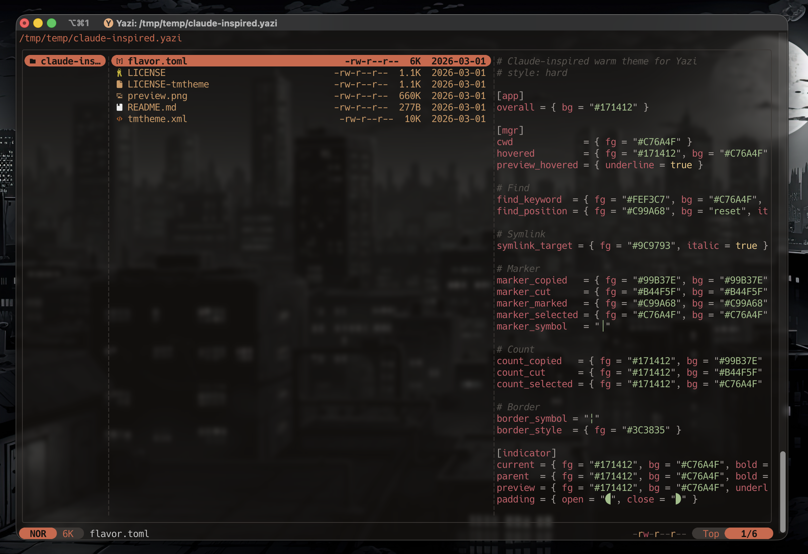

# claude-inspired.yazi

A warm, Claude-inspired color flavor for [Yazi](https://github.com/sxyazi/yazi) file manager.

Earthy orange, amber, and brown tones — dark background with high-contrast accents.



## Requirements

- Yazi ≥ 0.4
- A [Nerd Font](https://www.nerdfonts.com/) (for file icons and Powerline separators)

## Installation

```sh
ya pkg add rapidrabbit76/claude-inspired
```

Then set the flavor in `~/.config/yazi/theme.toml`:

```toml
[flavor]
dark  = "claude-inspired"
light = "claude-inspired"
```

## Color Palette

| Role | Hex | |
|---|---|---|
| Primary (orange) | `#C76A4F` | 🟠 |
| Secondary (amber) | `#C99A68` | 🟡 |
| Red | `#B44F5F` | 🔴 |
| Green | `#99B37E` | 🟢 |
| Cream (highlight fg) | `#FEF3C7` | 🟤 |
| Background | `#171412` | ⬛ |

## License

Theme: [MIT](LICENSE)  
Syntax highlighting (tmtheme): [MIT](LICENSE-tmtheme)
